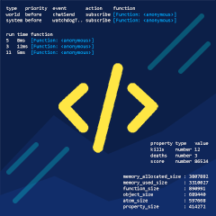

    
    

        Script API Web Debugger is a web version of Minecraft Bedrock Script API debugger that is interactable and is able to inspect further.
    

## Features & To-do

- [x] BDS Console
    - Prettier output

- [x] Process info
    - PID
    - Status
    - Exit code

- [x] Script Eval
    - Debugger variables & helpers, accessible through `this`
    - Minecraft modules (`mc`, `gt`, `mcui`)

- [x] Script Console Output
    - Logs script console, including stack trace

- [x] Event Inspector
    - Logs subscribe & unsubscribe listeners, including stack trace
    - Disable / enable listener
    - Event logs, including event data, timing, listeners, and error logs

- [x] Run Inspector
    - Logs runs methods (`run`, `runTimeout`, `runInterval`, and `clearRun`), including stack trace
    - Suspend / resume / clear runs
    - Logs Timing & errors of runs

- [x] Property inspector
    - Inspect world & entities property registries
    - Watch / unwatch entity dynamic properties

- [x] Stats
    - World tick timing (runs, events, worldtime)
    - Script used & size stats (from `script watchdog exportstats`)

- [ ] Form
    - Log form show calls, including stack trace
    - Form preview
    - Override form response

- [ ] Method Call Logs
    - Watch / unwatch native method call
    - Logs stack trace when a native method is called

## Setup

### Prerequisites

- Windows
    (untested on Linux)

- [BDS for Windows](https://www.minecraft.net/en-us/download/server/bedrock)
    (v1.20.12.01 or similar)

- [Node.js](https://nodejs.org/)
    (check with `node -v`)

- [Typescript](https://www.typescriptlang.org/download)
    (globally installed via npm, check with `tsc -v`)

- Browser
    (preferably [Firefox](https://firefox.com) because the GUI is potentially buggy with Chrome)

### Steps

1. Download / clone with git (`git clone https://github.com/frostice482/script-api-web-debugger`)

2. Run `setup.bat`. This will install all node dependencies and transpiles script on client, pack, and server folder.

    Alternatively, run `tsc -p client/tsconfig.json` and `tsc -p pack/tsconfig.json`.

3. Add a pack to be debugged with `pack.bat subadd path\to\pack_folder`. Replace `path\to\pack_folder` with the directory that points to the folder of the pack which contains `manifest.json`.

    This step can be skipped if there's no pack to be debugged.

4. Add the pack to the BDS with `pack.bat hook path\to\bds_folder`. Replace `path\to\bds_folder` with the directory that points to the folder of the BDS which contains `bedrock_server.exe`.

    If the BDS is fresh new, make sure to run it once before adding. This is required because the script will need to access and modify the world's `world_behavior_packs.json` and copy the pack into `development_behavior_packs` folder.

5. Start the server with `server.bat start path\to\bds_executable`. Replace `path\to\bds_executable` with the directory that points to the executable of the BDS (`bedrock_server.exe`).

6. Open the browser by pressing `Ctrl+O` in the node process or by opening `localhost:7070`.

### Notes

- It is recommended to disable script watchdog, as the debugger adds little to alot amount of overheads depending on the pack's intensity and may cause unwanted crash.

    It can be disabled by adding `script-watchdog-enable=false` in the `server.properties`.

- Using this may cause high CPU usage on all processes (Bedrock, Node, and the browser).

## Commands

### pack.bat

- `watch`                       - runs `tsc watch`
- `compile`                     - converts TS source code to JS compiled code
- `copy <path\to\folder>`       - copy pack to the folder
- `subadd <path\to\pack_folder>`- adds a script pack to be debugged
- `subrm`                       - removes an added script pack
- `hook <path\to\bds_folder>`   - adds and lists the pack to the bds world

    - Adds the pack to `[BDS]/development_behavior_packs/[UID]`. The pack UID is `9db69c9c-d264-4a43-995b-77971d5c41e2` unless changes.
    - Lists the pack to `[BDS]/worlds/[levelname]/world_behavior_packs.json`.

- `unhook <path\to\bds_folder>` - removes and unlists the pack from the bds world

### client.bat

- `watch`   - runs `tsc watch`
- `compile` - converts TS source code to JS compiled code

### server.bat

- `watch`                                  - runs `tsc watch`
- `compile`                                - converts TS source code to JS compiled code
- `start <path\to\bds_executable> <port?>` - Starts the server. Port is defaulted to `7070`.
